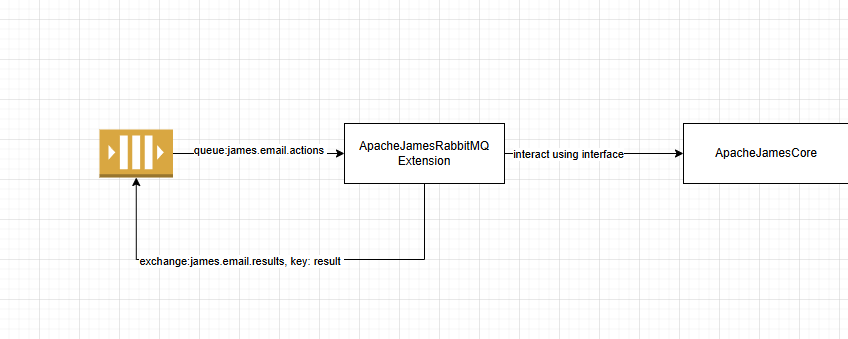
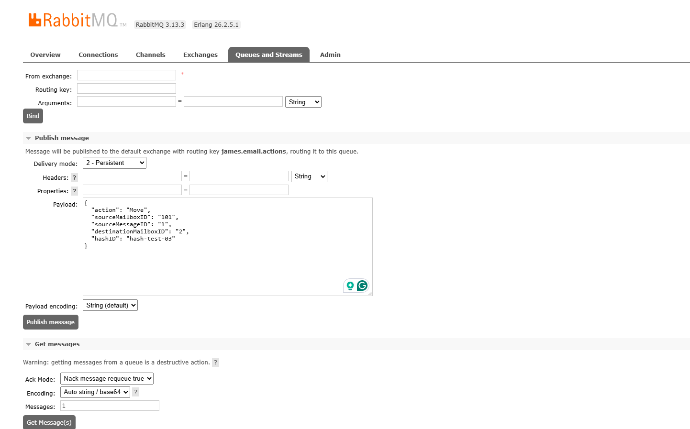

# Apache James RabbitMQ Listener

This module is a Java-based RabbitMQ listener designed to integrate with Apache James. It listens for action requests on a queue, processes JSON messages, and sends a result status to a response queue.

# Payload structure
## For MoveToTrash
```
{
  "action": "TRASH",
  "sourceMailboxID": "1",
  "sourceMessageID": "1",
  "destinationMailboxID": null,
  "hashID": "test-trash-1"
}
```
## For MoveToOther
```
{
  "action": "MOVE",
  "sourceMailboxID": "1",
  "sourceMessageID": "1",
  "destinationMailboxID": "1",
  "hashID": "test-move-1"
}
```
## Result

```
Success message
{
  "hashID": "test-trash-1",
  "status": "SUCCESS",
  "message": "Message successfully moved to trash",
  "timestamp": 1748445808978
}
Failure message

{
  "hashID": "test-trash-1",
  "status": "FAILED",
  "message": "Cannot found mailbox",
  "timestamp": 1748445808978
}
```

# Detail design



# How to deployment
## Prepare jar file
1.Build jar file
```
mvn clean compile package
```
2.Add jar file to folder
```
/root/extensions-jars
```
## Create the configuration file
1.Create the rabbitmq.properties and add it to /root/conf folder
```
# RabbitMQ Extension Configuration
rabbitmq.host=rabbitmq
rabbitmq.port=5672
rabbitmq.username=james
rabbitmq.password=secret
rabbitmq.virtualHost=/
rabbitmq.inputQueue=james.email.actions
rabbitmq.outputExchange=james.email.results
rabbitmq.outputRoutingKey=result
```
2.Update or create file extensions.properties and add it to /root/conf folder
```
# Enable the RabbitMQ extension
guice.extension.module=com.example.rabbitmq.JamesRabbitMQModule
```

# How to test
```
# Build with assembly plugin (default)
mvn clean compile package

# Run docker
docker compose up -d
```
# Test scenario

Create two users
```
curl --location --request PUT 'http://localhost:8000/users/testuser1@localhost' \
--header 'Content-Type: application/json' \
--data '{"password":"testpass"}'

curl --location --request PUT 'http://localhost:8000/users/testuser2@localhost' \
--header 'Content-Type: application/json' \
--data '{"password":"testpass"}'
```
Create mailbox

```
curl --location --request PUT 'http://localhost:8000/users/testuser@localhost/mailboxes/INBOX'
curl --location --request PUT 'http://localhost:8000/users/testuser@localhost/mailboxes/TRASH'
curl --location --request PUT 'http://localhost:8000/users/testuser2@localhost/mailboxes/INBOX'
curl --location --request PUT 'http://localhost:8000/users/testuser2@localhost/mailboxes/TRASH'
```
using telnet to send message
```
telnet localhost 25
HELO localhost
MAIL FROM:<testuser@localhost>
RCPT TO:<testuser2@localhost>
DATA
Subject: Hello from Telnet

This is a test.
.
QUIT

```

Create the Queue to fetch data for test from Exchange


Binding exchange result to queue


Test send message
  Go to url: http://localhost:15672/#/queues/%2F/james.email.actions
Publish message


Go back to QUEUE_TEST to get the result


## 📝 License

MIT License
