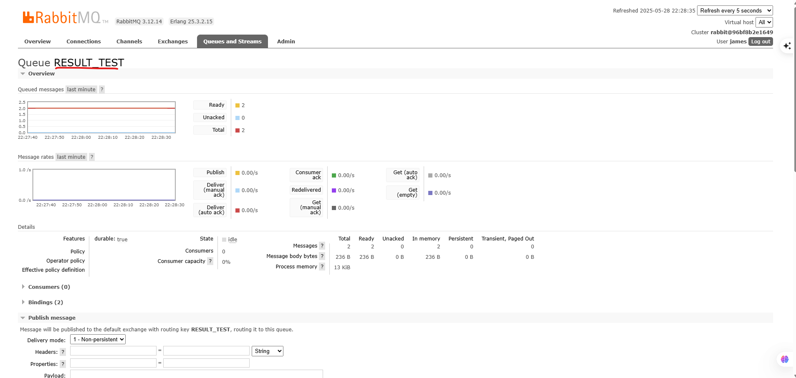
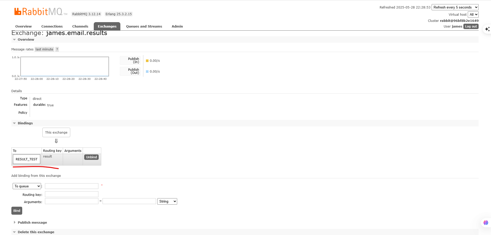
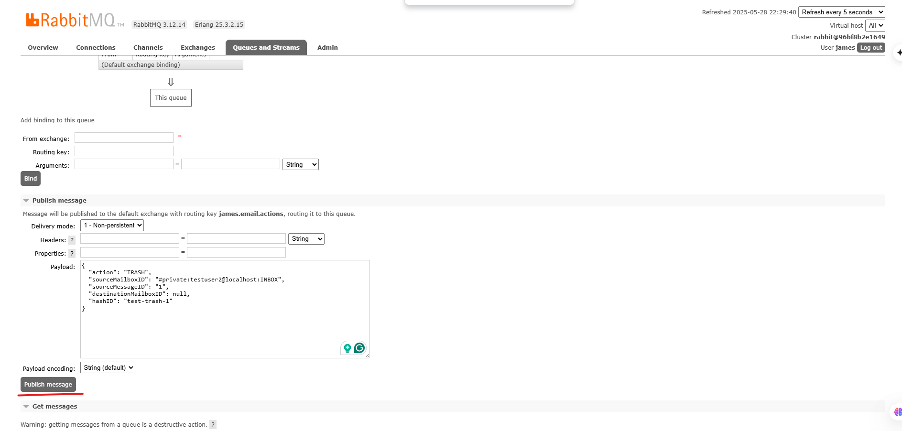
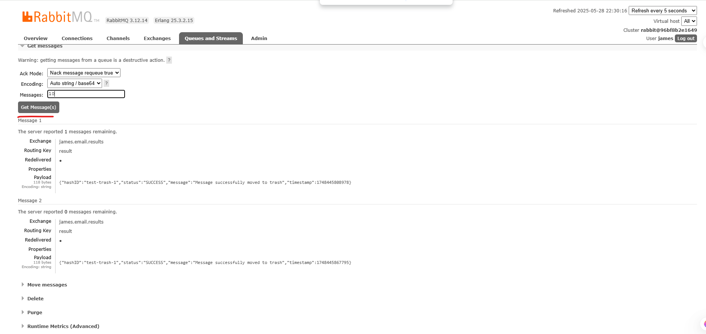

# Apache James RabbitMQ Listener

This module is a Java-based RabbitMQ listener designed to integrate with Apache James. It listens for action requests on a queue, processes JSON messages, and sends a result status to a response queue.

---

## 🚀 Current Features

- Connects to RabbitMQ via `localhost:5672`
- Listens on `james-actions` queue
- Parses incoming JSON messages:
  ```json
  {
    "action": "move",
    "sourceMailboxID": "user1@example.com",
    "sourceMessageID": "msg123",
    "destinationMailboxID": "user2@example.com",
    "hashID": "test001"
  }
  ```
- Logs action and prepares for mailbox operation
- Sends result to `james-results` queue:
  ```json
  {
    "hashID": "test001",
    "status": "success"
  }
  ```

---

## 🛠️ Prerequisites

- Java 11+
- Maven
- RabbitMQ running locally or via Docker:
  ```bash
  docker run -d --hostname my-rabbit --name rabbitmq -p 5672:5672 -p 15672:15672 rabbitmq:3-management
  ```

Access RabbitMQ UI at [http://localhost:15672](http://localhost:15672)  
Login: `guest` / `guest`

---

## 🔧 Setup & Run

### Build the project:

```bash
mvn clean compile
```

### Run the listener:

```bash
mvn exec:java -Dexec.mainClass="com.example.rabbitmq.RabbitMQListener"
```

You should see logs like:

```
[Init] Starting RabbitMQListener...
[Receive] {...}
[Process] ...
[Send] {"hashID":"...","status":"success"}
```

---

## 🧪 Test a Message

Use RabbitMQ Web UI or CLI to send this to `james-actions`:

```json
{
  "action": "move",
  "sourceMailboxID": "user1@example.com",
  "sourceMessageID": "msg123",
  "destinationMailboxID": "user2@example.com",
  "hashID": "test001"
}
```

Check `james-results` queue for:

```json
{ "hashID": "test001", "status": "success" }
```

---

## 🧩 Next Steps

- Integrate with Apache James `MailboxManager`
- Locate and move/trash messages based on input
- Add error handling for mailbox failures
- Prepare extension JAR for deployment

---

## 📁 File Structure

```
src/
└── main/
    └── java/
        └── com/
            └── example/
                └── rabbitmq/
                    └── RabbitMQListener.java
```

---

# How to test
```
# Build with assembly plugin (default)
mvn clean compile package

# Or build with shade plugin
mvn clean compile package -Pshade

# Run docker
docker compose up -d
```
# Test scenario

Create two users
```
curl --location --request PUT 'http://localhost:8000/users/testuser1@localhost' \
--header 'Content-Type: application/json' \
--data '{"password":"testpass"}'

curl --location --request PUT 'http://localhost:8000/users/testuser2@localhost' \
--header 'Content-Type: application/json' \
--data '{"password":"testpass"}'
```
Create mailbox

```
curl --location --request PUT 'http://localhost:8000/users/testuser@localhost/mailboxes/INBOX'
curl --location --request PUT 'http://localhost:8000/users/testuser@localhost/mailboxes/TRASH'
curl --location --request PUT 'http://localhost:8000/users/testuser2@localhost/mailboxes/INBOX'
curl --location --request PUT 'http://localhost:8000/users/testuser2@localhost/mailboxes/TRASH'
```
using telnet to send message
```
telnet localhost 25
HELO localhost
MAIL FROM:<testuser@localhost>
RCPT TO:<testuser2@localhost>
DATA
Subject: Hello from Telnet

This is a test.
.
QUIT

```

Create the Queue to fetch data for test from Exchange



Binding exchange result to queue




Test send message
  Go to url: http://localhost:15672/#/queues/%2F/james.email.actions
Publish message


Go back to QUEUE_TEST to get the result




## 📝 License

MIT License
